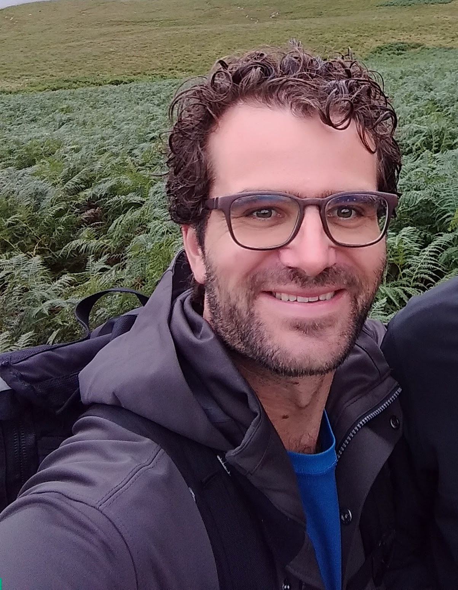

	

### Research
My primary research interests lie in population genetics, especially developing and applying methods to understand the recent history of populations. I work with both human and non-human populations, often with a history of admixture.  I am currently working on methods that utilize local ancestry information to understand the recent demographic history of admixed populations.

Recent work has focused on:
* Understanding the genetic history of Greenlandic-European contact   [paper](link)
* Inferring relatedness in the absence of allele frequencies [paper](link)
* Assessing genetic diversity in African Leopards [paper](https://doi.org/10.1016/j.cub.2021.01.064)
* Inferring linkage disequilibrium (LD) patterns in recently admixed populations [method](link)
* Better quantifying uncertainty when genetic data are not independent (and they never are!) [paper](https://doi.org/10.1111/1755-0998.13482)

I am a postdoc with [Dr. Sharon Browning](https://www.biostat.washington.edu/people/sharon-browning) at the [Department of Biostatistics](https://www.biostat.washington.edu/) at the University of Washington in Seattle, WA.

I obtained my Ph.D. in Statistical Population Genetics from the University of Copenhagen, Denmark in 2019, co-advised by [Dr. Ida Moltke](https://idamoltke.wordpress.com/news/) and [Dr. Anders Albrechtsen](https://www1.bio.ku.dk/english/staff/?pure=en/persons/280554).  My thesis "Relatdness, admixture and the genetic history of Greenland-European contact" is available [here](https://rwaples.github.io/assets/Waples_Thesis_book2.pdf).

I obtained my M.S. in 2015 from the School of Aquatic and Fishery Sciences at the University of Washington and my B.A. from Wesleyan University in 2004.

### Contact Info

    

            <b>Email</b>: ryan.waples *at* gmail *dot* com  
            <b>GitHub</b>: <a href="https://github.com/rwaples">https://github.com/rwaples</a> 
            <b>Twitter</b>: <a href="https://twitter.com/waplesryan">@waplesryan</a> 
    

### Links
* [Google Scholar profile](https://scholar.google.com/citations?user=JHBKiDgAAAAJ)
* [CV](https://rwaples.github.io/assets/cv.pdf)
